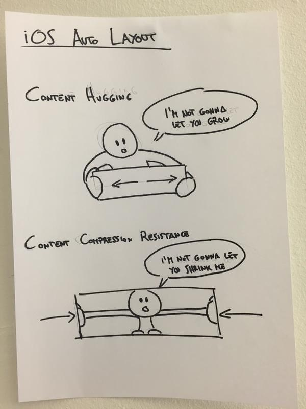

# Intrinsic content size

from [here](https://krakendev.io/blog/autolayout-magic-like-harry-potter-but-real)

## `content hugging`
* When you want a view to resist growing larger than its intrinsic content size,
* this is the property you want to be looking at.

## `content compression resistance`
* When you want a view to resist being resized smaller than its content,
* then this is the property that you want to be looking at.

## Priority
* 1 is a Low priority
* 1000 is a Required priority.
* the higher the priority for `content hugging`

`UILayoutPriority`

`UILayoutConstraintAxis`

`UIViewNoIntrinsicMetric`
