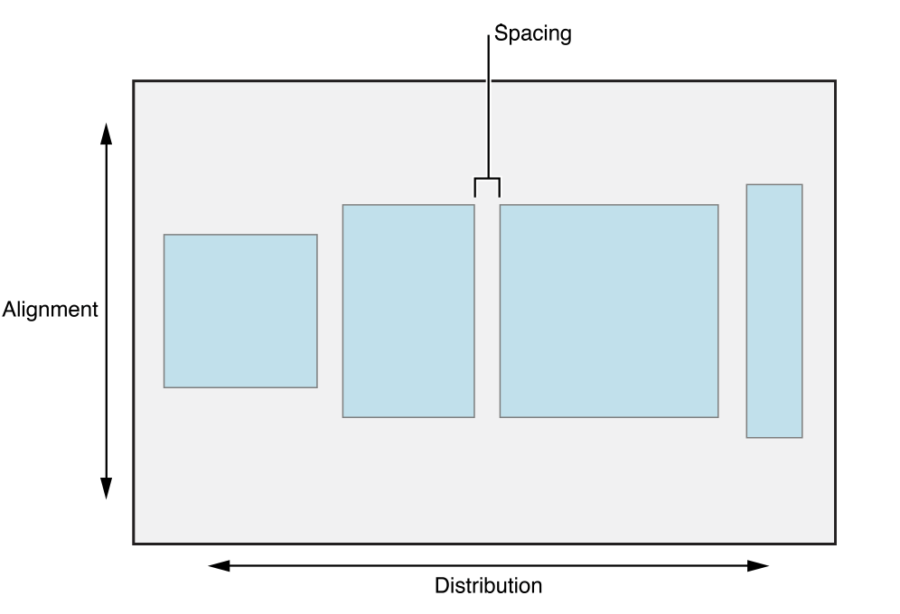

# StackViews

*  uses the intrinsic content size of its `arrangedSubviews` to size itself

## `alignment`
useful [visualizations](https://developer.apple.com/documentation/uikit/uistackviewalignment)

This property determines how the stack view lays out its arranged views
perpendicularly to its axis. The default value is `fill`. For a list of possible
values, see `UIStackViewAlignment`.

#### `fill`
A layout where the stack view resizes its arranged views so that they fill the
available space perpendicular to the stack view’s axis.

#### `leading`
A layout for vertical stacks where the stack view aligns the leading edge of its
arranged views along its leading edge. This is equivalent to the top alignment
for horizontal stacks.

#### `top`
A layout for horizontal stacks where the stack view aligns the top edge of its
arranged views along its top edge. This is equivalent to the leading alignment
for vertical stacks.

#### `firstBaseline`
A layout where the stack view aligns its arranged views based on their first
baseline. This alignment is only valid for horizontal stacks.

#### `center`
A layout where the stack view aligns the center of its arranged views with its
center along its axis.

#### `trailing`
A layout for vertical stacks where the stack view aligns the trailing edge of
its arranged views along its trailing edge. This is equivalent to the bottom
alignment for horizontal stacks.

#### `bottom`
A layout for horizontal stacks where the stack view aligns the bottom edge of
its arranged views along its bottom edge. This is equivalent to the trailing
alignment for vertical stacks.

#### `lastBaseline`
A layout where the stack view aligns its arranged views based on their last
baseline. This alignment is only valid for horizontal stacks.

## `axis`
The axis along which the arranged views are laid out.

## `isBaselineRelativeArrangement`
A `Boolean` value that determines whether the vertical spacing between views is
measured from their baselines.

## `distribution`
This property determines how the stack view lays out its arranged views along
its axis. The default value is `fill`. For a list of possible values, see
`UIStackViewDistribution`.

#### `fill`
* uses `intrinsicSize` of its `arrangedSubviews`
#### `fillEqually`
* If possible, the stack view stretches all the arranged views to match the view
with the longest `intrinsicSize` along the stack’s `axis`.
* resizes all the `arrangedSubviews` so they are the same size, filling the stack view along its `axis`.
#### `fillProportionally`
* uses `intrinsicSize` of its `arrangedSubviews`
#### `equalSpacing`
* uses `intrinsicSize` of its `arrangedSubviews`
#### `equalCentering`
* uses `intrinsicSize` of its `arrangedSubviews`

## `isLayoutMarginsRelativeArrangement`
A `Boolean` value that determines whether the stack view lays out its arranged
views relative to its layout margins.

If true, the stack view will layout its arranged views relative to its layout margins. If false, it lays out the arranged views relative to its bounds. The default is false.

## `spacing`
The distance in points between the adjacent edges of the stack view’s arranged
views.

This property defines a strict spacing between arranged views for the
`fillProportionally` distributions. It represents the minimum spacing for the
`equalSpacing` and `equalCentering` distributions. Use negative values to allow
overlap. The default value is 0.0.
