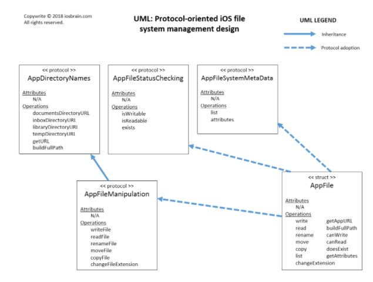

# Diagramming

* dotted line - runtime reference
* straight line - compile time reference

## example, UML

from [here](http://iosbrain.com/blog/2018/04/22/ios-file-management-with-filemanager-in-protocol-oriented-swift-4/?utm_source=Swift_Developments&utm_medium=email&utm_campaign=Swift_Developments_Issue_133)

