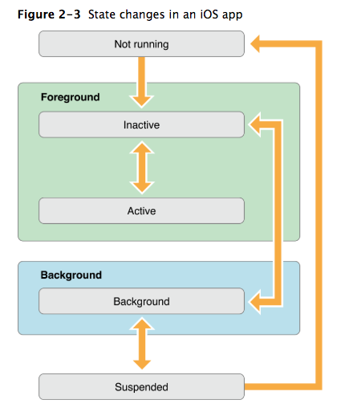

# Background

* from [here](https://www.raywenderlich.com/890-background-modes-tutorial-getting-started)

Your app is only allowed to keep running in the background in very specific
cases.

these include:  
* playing audio,
* getting location updates
* fetching the latest content from a server.
* Perform finite-length tasks: the generic “whatever” case, where the app can run
arbitrary code for a limited amount of time.

## States



```swift
// —This method is your app’s first chance to execute code at launch time.
application:willFinishLaunchingWithOptions:

// This method allows you to perform any final initialization before your app is
// displayed to the user.
application:didFinishLaunchingWithOptions:

// Lets your app know that it is about to become the foreground app. Use this
// method for any last minute preparation.
applicationDidBecomeActive:

// Lets you know that your app is transitioning away from being the foreground
// app. Use this method to put your app into a quiescent state.
applicationWillResignActive:

// Lets you know that your app is now running in the background and may be
// suspended at any time.
applicationDidEnterBackground:

// Lets you know that your app is moving out of the background and back into the
// foreground, but that it is not yet active.
applicationWillEnterForeground:

// Lets you know that your app is being terminated. This method is not called if
// your app is suspended.
applicationWillTerminate:
```

# `UIBackgroundModes`

* `fetch`

## `UIApplication`
```swift
func beginBackgroundTask(withName: String?, expirationHandler: (() -> Void)? = nil)
func beginBackgroundTask(withName taskName: String?, expirationHandler handler: (() -> Void)? = nil) -> UIBackgroundTaskIdentifier
```
